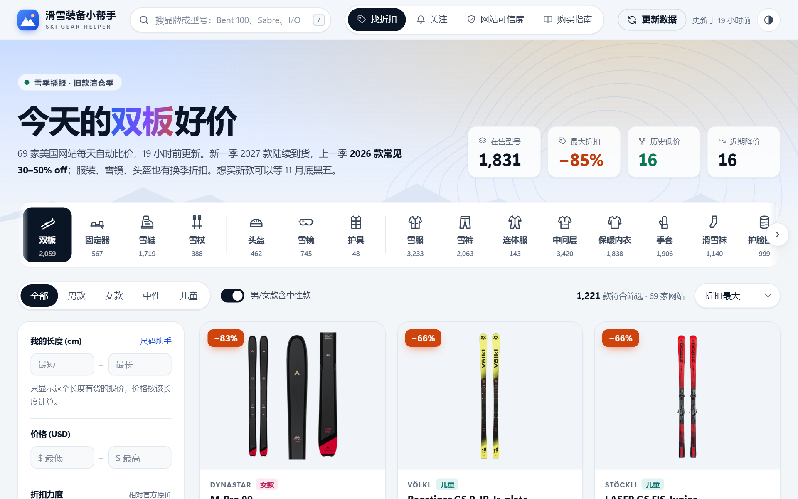
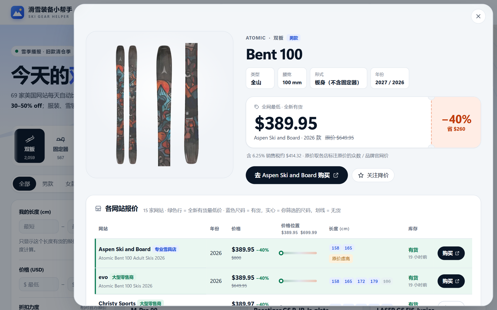
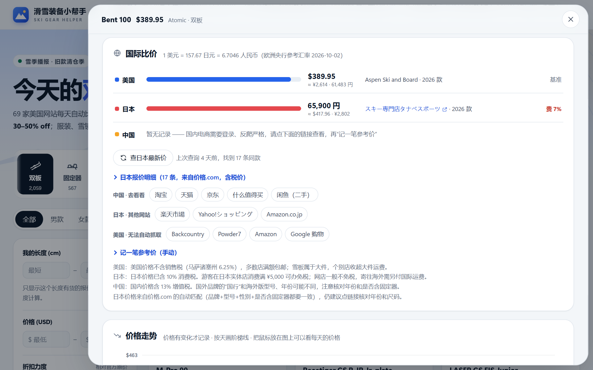
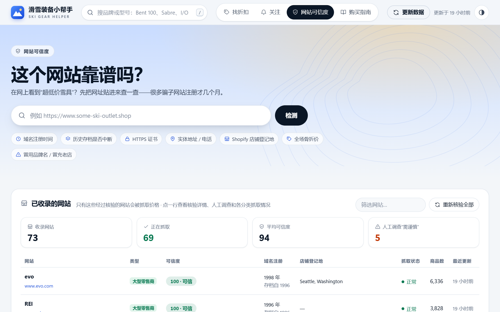
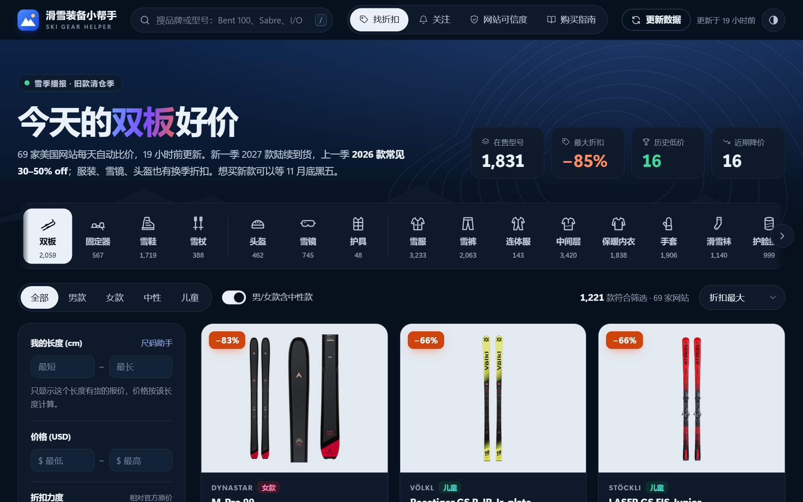
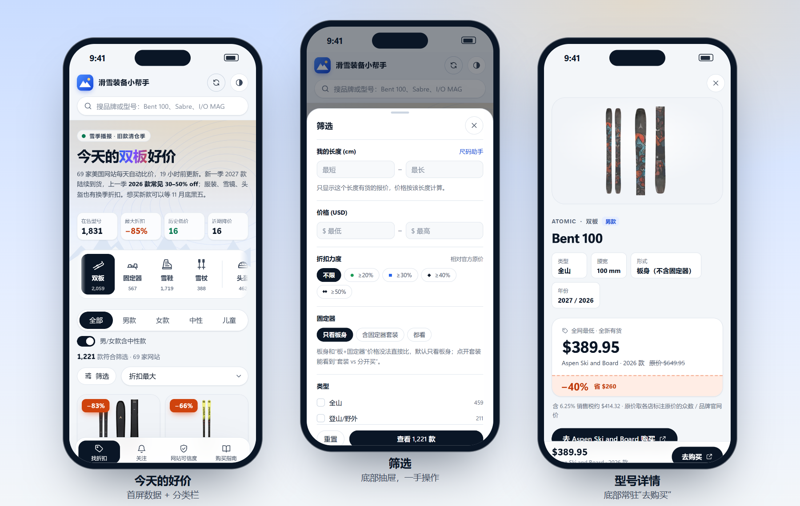

<div align="center">

# ❄️ 滑雪装备小帮手

**Ski Gear Helper** —— 在自己电脑上运行的滑雪装备比价工具

把 **69 家美国雪具网站**、**22 类装备**的价格放进同一个页面：同款自动对齐、只看你的尺码有没有货、看清真假折扣；<br>
双板还附**日本 / 中国参考价**，并帮你**识别山寨雪具网站**。

[](https://github.com/momomojun/ski-gear-helper/actions/workflows/tests.yml)
[](https://www.python.org/downloads/)
[](https://fastapi.tiangolo.com/)
[](https://www.sqlite.org/)
[](LICENSE)

[快速开始](#快速开始) · [截图](#截图) · [功能一览](#功能一览) · [数据来源](#数据来源) · [抓取原则](#抓取原则) · [English](#english)



</div>

## 为什么做这个

在美国买雪具，同一块板在 evo、REI、Christy Sports 和品牌官网的价格能差一两百美元；打折季热门尺码一两天就断货；
搜“ski outlet”还会搜到冒充正规店的山寨网站（比如冒充 Utah Ski Gear 的 `utahskigearonline.shop`）。一家家翻太累，于是做了这个小工具：

- 🔍 **一处比价**：69 家核验过的网站、2.5 万款商品，同一款在不同网站的报价合并成一张卡片
- 📏 **按尺码看有货**：只显示你的长度 / 鞋码 / S·M·L **有货**的报价——打折常常只剩冷门尺码
- 📉 **看清真假折扣**：记录价格历史，标出历史低价、刚降价、“原价虚高”
- 🎿 **固定器怎么配**：套装和分开买哪个划算；按板子腰宽挑刹车宽度合适、有货的固定器
- 🌏 **国际比价**：美国最低价 vs 日本（价格.com）vs 中国（手动记录），按当天汇率换算
- 🛡️ **识别山寨网站**：任何网址贴进来打 0–100 分——域名注册时间、历史存档、冒用品牌名、全场骨折价……
- 🔔 **降价提醒**：关注的型号降到目标价时提醒（Windows 弹通知）
- 🌙 **好看也好用**：浅色“晴天”/ 深色“夜场”两套主题，手机上是底部标签栏 + 筛选抽屉；支持键盘操作和“减少动态效果”

全部在你自己的电脑上运行：不用注册账号、不用服务器，数据只存在本地。

## 截图

<table>
<tr>
<td width="50%"></td>
<td width="50%"></td>
</tr>
<tr>
<td align="center">型号详情：15 家网站的报价、每个长度的库存</td>
<td align="center">国际比价（美国 vs 日本 vs 中国）和价格走势</td>
</tr>
<tr>
<td width="50%"></td>
<td width="50%"></td>
</tr>
<tr>
<td align="center">网站可信度：检测任意网址；已收录网站的分数、域名年份、抓取状态</td>
<td align="center">深色模式（“夜场”），可以跟随系统或手动切换</td>
</tr>
<tr>
<td colspan="2"></td>
</tr>
<tr>
<td colspan="2" align="center">手机版：底部标签栏、单手操作的筛选抽屉、详情页底部常驻“去购买”</td>
</tr>
</table>

## 快速开始

### Windows（推荐）

1. 安装 [Python 3.11 或更新版本](https://www.python.org/downloads/)（安装时勾选 **Add python.exe to PATH**）
2. 下载代码：点本页上方绿色的 **Code → Download ZIP** 后解压；或者用 git：
   ```bash
   git clone https://github.com/momomojun/ski-gear-helper.git
   ```
3. 双击 **`start.bat`**
   - 第一次会自动创建 Python 环境、安装依赖（约 1 分钟），之后秒开
   - 浏览器会自动打开 <http://127.0.0.1:8765>
4. 第一次启动时数据库是空的，程序会**自动开始第一次抓取**（全品类约 20–30 分钟，可以边抓边看）
5. 用完关掉黑色命令行窗口即可；之后网页开着时每 24 小时自动更新一次

### macOS / Linux

```bash
python3 -m venv .venv
.venv/bin/pip install -r requirements.txt
.venv/bin/python -m skideals serve --open
```

> 主要在 Windows 上开发和测试；降价弹窗通知只支持 Windows，其他功能各系统通用。
> 数据只保存在 `data/skideals.db`，不会上传到任何地方。

## 功能一览

### 1. 找折扣（首页）
- **22 个分类**：双板、固定器、雪鞋、雪杖、头盔、雪镜、护具、雪服、雪裤、连体服、中间层、保暖内衣、手套、袜子、护脸、帽子、
  滑雪背包、雪板包、雪崩安全装备、止滑带、打蜡/修板工具、其他配件；每个分类的筛选条件分开记住
- **性别**：全部 / 男款 / 女款 / Unisex 中性 / 儿童（默认“男/女款里包含中性款”，可以取消）
- **我的尺码**（按分类自动切换）：
  - 双板/雪杖：长度 cm；雪鞋：Mondo 鞋码（26.0 和 26.5 算同一个鞋壳）；固定器：我的雪板腰宽（只显示刹车宽度合适的）
  - 服装/手套/头盔：S/M/L…（“S/M”两码合一的选 S 或 M 都会命中）；数字码、童码、欧码、头围收在“更多尺码”里
  - 只显示**这个尺码有货**的报价，价格也按这个尺码算
- **特征标签**：GORE-TEX、保暖/硬壳/软壳/三合一、背带裤、美利奴羊毛、连指手套、MIPS、亚洲版型、磁吸换片、OTG、GripWalk、登山、气囊包……
- **分类专属筛选**：双板的类型/腰宽/含不含固定器；固定器的 DIN 档位；雪鞋的硬度（Flex）和楦宽（Last）
- 价格区间、折扣力度（相对官方原价）、年份、品牌、成色（全新/试用/二手/瑕疵）、网站
- 排序：折扣最大 / 省得最多 / 价格 / 比价网站最多 / 各家价差最大
- 卡片标签：历史低价、刚降价、仅剩 1–2 个尺码、原价虚高

### 2. 型号详情（点开任意卡片）
- **各网站报价对比表**：年份、价格、原价、折扣、每个尺码的库存（你的尺码会高亮）、直达购买链接
- **规格**：双板腰宽和类型、固定器 DIN 范围和刹车宽度、雪鞋 Flex/楦宽、背包容量
- **固定器专题**（双板）：
  - 套装：**“套装 vs 分开买”**——同型号板身最低价 + 同款固定器最低价，和套装价比哪个划算（固定器只算刹车装得上这块板、有货的尺码）
  - 板身：**“搭配固定器”**——按腰宽挑刹车合适、有货的固定器，按 DIN 档位（入门/进阶/高级/专家）各列最便宜的 3 款
- **价格走势图**：价格有变化就记录，能看出“折扣”是真是假
- **国际比价**：美国最低价 vs 日本（价格.com 自动查询）vs 中国（手动记录），按当天欧洲央行汇率换算，并标出“便宜/贵百分之几”
- **关注降价**：设目标价（可指定尺码/年份），降到目标价或降价 3% 以上时，在「关注」页提醒并弹 Windows 通知
- **价格匹配提示**：最低价不在大店时，提示哪些店也有货并接受价格匹配（例如 evo 承诺比其他美国授权零售商再低 5%）
- 相近型号：同型号的女款、儿童款、Ti 版、含固定器版本

### 3. 网站可信度
- **检测任意网站**：在网上看到“超低价雪具”？把网址贴进来，给出 0–100 分和逐条理由：
  - 域名注册时间（RDAP/WHOIS）——骗子网站几乎都是几个月内新注册的
  - 互联网档案馆最早存档——老店十几年前就有记录；存档**中断多年后突然复活** = 可能是买来的过期老域名
  - HTTPS 证书、实体地址、电话、退货/运费政策；Shopify 店铺登记地（自称美国店却登记在别国要警惕）
  - **全场半价以下**——假“outlet/清仓”站的典型特征
  - 域名冒用品牌名（如 `atomic-outlet-sale.shop`）、冒充已知零售商（真实案例：`utahskigearonline.shop`）、可疑后缀（.shop/.top/.xyz…）
  - 附 Trustpilot / BBB / ScamAdviser / Google 安全浏览 / Reddit 的人工复核链接
- **已收录网站列表**：只有核验过的网站才会被抓取；显示每家的分数、域名注册年份、登记地、每个分类的抓取状态和商品数；
  点开还有**人工调查**：总部、成立年份、股权变化、实体店、BBB/Trustpilot、常见投诉、退货/运费/价格匹配政策，附来源链接

### 4. 购买指南
- 什么时候买最便宜（季节日历）、尺码助手（身高/体重/水平/滑法/雪场 → 推荐长度和腰宽，一键应用到筛选）
- **装备怎么选**：固定器（DIN、刹车宽度、GripWalk）、雪鞋、雪服、雪镜、头盔等各分类的选购要点
- 省钱与避坑、**雪具网购常见骗局**（附 Burton/FTC 等来源）、在日本/中国买的注意事项、设置（销售税、自动更新、通知）

## 数据来源

**美国（自动抓取）**

| 类型 | 网站 |
|---|---|
| 大型零售商 | evo、REI、Christy Sports、Sports Basement、Peter Glenn、Sun & Ski Sports、**Zappos**（只抓滑雪服装：有 The North Face、Columbia、Helly Hansen、Arc'teryx 这些官网抓不了的品牌） |
| 专业雪具店 / 户外店 | Skis.com、Ski Essentials、The Ski Monster、Start Haus、Alpine Shop (VT)、Outdoor Gear Exchange、Ski Depot/RaceSkis、Aspen Ski and Board、Utah Ski Gear、Cripple Creek Backcountry、Colorado Ski Shop、Neptune Mountaineering、Tahoe Mountain Sports、Jans、Campmor、Gorsuch、EMS |
| 双板品牌官网（原价参考） | Black Crows、Armada、DPS、Moment、4FRNT、J Skis、Icelantic、Liberty、Black Diamond |
| 服装 / 配件品牌官网 | Marmot、Spyder、Obermeyer、Volcom、Outdoor Research、Smartwool、Flylow、Stio、Strafe、Halfdays、Fera、686、Airblaster、Jones、Trew、Mons Royale、Minus33、Hot Chillys、Blackstrap、Ibex、Voormi、Duckworth、Aztech、Seirus、Swany、Gordini、Kombi、Give'r、Skida、Turtle Fur、Coal、Dakine、Stance、Darn Tough、Point6、Farm to Feet |

- 每家网站**每个分类去哪一页抓**写在 `config/categories.toml`；Shopify 店的配置用 `discover` 命令自动生成、再人工检查
- **人工调查**：收录的 73 家网站都整理了公开资料（总部、成立年份、股权变化、BBB、Trustpilot、常见投诉、退货/运费/价格匹配政策，附来源链接），
  数据在 `config/due_diligence.json`；调查中还发现了冒充 Strafe、Flylow 的山寨域名（已失效）
- **默认停用**（配置里保留，想看可以自己打开）：**The House**（2023 年原公司被清算、BBB 3 年 1,025 条投诉，另外抓取方式属灰色地带，见下文）、
  **Buckman's**（和 Skis.com 同一家公司、同一套库存）、**Paragon**（商品数据不区分品类）、
  **Tactics**（2025 年在连续亏损后被出售，2026 年 4 家门店关了 3 家，近期投诉集中在订单被取消和退款被扣钱）
- 抓不了的：**Backcountry / Steep & Cheap、Powder7、Amazon、Patagonia、The North Face、Columbia、Mountain Hardwear、Helly Hansen、Arc'teryx、Kjus、Sierra、Dick's、Nordstrom**（强反爬：验证码 / 挑战页，工具不绕过）；
  **Atomic / Elan / Faction 官网**的公开数据是欧元基础价，**Orage、Picture** 是加元 / 欧元店，不代表美国售价；**Moosejaw** 已关闭——详情页提供一键搜索链接
- 完整名单和每家的核验结果见网页「网站可信度」页，配置在 `config/retailers.toml`

**日本（自动）**：价格.com 汇总的乐天、Yahoo!购物等网店报价，按“品牌 + 型号 + 性别 + 是否含固定器 + 分类”自动匹配同款，打开型号详情时查询，缓存 3 天

**中国（手动）**：淘宝、天猫、京东都要求登录，并有滑块验证等严格反爬，**无法稳定自动抓取**。详情页提供一键搜索链接（按分类用中文品类词），你在浏览器里看到价格后“记一笔参考价”，工具会自动换算对比

## 抓取原则

礼貌、合规，宁可少抓也不给网站添麻烦：

- 遵守每个网站的 `robots.txt`（支持通配符规则和 Crawl-delay）
- 同一网站的请求串行、间隔 ≥ 1.5 秒；一次全品类更新约 2,500 个请求（69 家网站并行）
- 网页解析类网站只对打折商品抓详情页（取尺码库存），每类有页数上限
- 不破解验证码、不登录任何账号；被反爬拦截就如实显示“被拦截”，不绕过
- 只供个人使用：数据只存在你自己的电脑上，本仓库不包含、也不公开发布任何抓到的数据
- **The House**（默认停用）：它的商品列表只存在于网页调用的 Algolia 搜索服务里，抓取器会读取 `/skis` 页面里公开的只读配置、每次更新发 1 个请求；
  它的 robots.txt 禁止抓取自己域名下的 `/search` 路径（严格说不适用于 Algolia 的域名，但属于灰色地带）。再加上人工调查结果是“谨慎”，所以默认关闭

## 同款是怎么识别的？

各网站标题写法不一样，比如：
```
Blizzard Black Pearl 88 Skis - Women's 2026      （evo）
Blizzard Black Pearl 88 Women's Skis 2026        （另一家）
Marker Griffon 13 ID Black 90mm                   （品牌官网转卖的固定器）
BLIZZARD ブリザード BLACK PEARL 88 (FLAT) 25-26 レディース   （日本）
```
1. **分类判定**（`skideals/categories.py`）：零售商的分类页经常是混装的（Sports Basement 的“头盔”页其实是头盔 + 雪镜，“雪杖”页里全是配件），
   所以按证据判定：标题关键词 → 网站自己的分类/标签（`BreadcrumbClass:Goggles`）→ 选项名（“Frame + Lens” = 雪镜）；
   零件配件（刹车片、替换镜片、雪托、雪镜套、电池）归“其他配件”，太阳镜、自行车头盔、越野滑雪装备直接不要；
   没有任何证据时才相信分类页，混装页里没证据的不要。商品会被**改判到正确的分类**（头盔页里的雪镜 → 雪镜）
2. **标准化**（`skideals/normalize.py`）：识别品牌 / 型号 / 年份（25-26 → 2026）/ 性别 / 成色 / 规格 / 特征，去掉颜色、刹车宽度、长度这些“款式”信息。
   品牌表收录 300 多个品牌；没收录的从各网站的 vendor 里**学**，统一写法（`AUCLAIR`→Auclair、`LE BENT`→Le Bent），
   网站没写品牌时从标题开头或网址里认；实在认不出的显示“未标品牌”
3. **分组**：双板按 **品牌 + 型号（词序无关）+ 性别大类 + 是否含固定器**；其他分类按 **分类 + 品牌 + 型号 + 性别大类**。同一型号的不同年份放在同一张卡片里，每个报价单独标年份
4. **尺码统一**：`X-Large`→XL、`M-L`→M/L、`MP 27/27.5`→27、`Brake 90`→90mm、`46"`→115cm…
5. **双板腰宽**：先从商品描述和型号名里读（Soul **92**、“96mm waist”），多家网站加权投票；还缺的用 `specs` 命令去商品页的规格表里补（“Waist Width: 67”“131/96/117”），
   会排除“60 - 79mm”这类筛选分档

规则都有单元测试（`tests/`，用的全是真实网站上抓到的标题，共 264 个）。发现分错类/分错组：先跑 `audit` 看问题，在这里补规则，然后运行 `renormalize` 用新规则重算已有数据。

## 常用命令

```powershell
.venv\Scripts\python -m skideals serve --open              # 启动网页（= start.bat）
.venv\Scripts\python -m skideals crawl                     # 抓取全部网站、全部分类（= crawl.bat）
.venv\Scripts\python -m skideals crawl evo rei             # 只抓指定网站
.venv\Scripts\python -m skideals crawl -c jacket -c goggle # 只抓指定分类
.venv\Scripts\python -m skideals specs                     # 双板缺腰宽的，去商品页规格表里补
.venv\Scripts\python -m skideals discover https://某Shopify店.com   # 自动找出这家店各分类的页面
.venv\Scripts\python -m skideals renormalize               # 规则改进后，用新规则重算已有商品（不用重新抓）
.venv\Scripts\python -m skideals audit                     # 数据质量自检：可能分错类、品牌写法乱、价格异常的商品
.venv\Scripts\python -m skideals check-site https://某网站.com      # 命令行检测网站可信度
.venv\Scripts\python -m skideals check-retailers           # 重新核验全部已收录网站
.venv\Scripts\python -m skideals stats                     # 各网站商品数量
.venv\Scripts\python -m pytest -q                          # 运行单元测试
```

**自动更新**：网页开着时默认每 24 小时自动更新一次（「购买指南 → 设置」里可改）。想在不开网页时也每天更新，可以注册 Windows 计划任务：
```powershell
powershell -ExecutionPolicy Bypass -File scripts\install_daily_task.ps1
```
（取消：`Unregister-ScheduledTask -TaskName "SkiDeals Daily Crawl" -Confirm:$false`）

## 添加一个新网站

1. 先在网页「网站可信度」里检测它，确认可信
2. 如果它是 Shopify 店（大多数小雪具店都是）：
   - 在 `config/retailers.toml` 里加一段基本信息（双板的分类页写在这里）：
     ```toml
     [[retailers]]
     id = "newshop"
     name = "New Shop"
     url = "https://www.newshop.com"
     adapter = "shopify"
     tier = "B"
     collections = ["skis"]                       # 双板分类页
     [retailers.hints]
     "womens-skis" = { gender = "women" }          # 性别分类（可选）
     ```
   - 运行 `python -m skideals discover https://www.newshop.com`，把生成的 `[newshop.<分类>]` 片段检查一遍后贴进 `config/categories.toml`
3. 不是 Shopify 的网站需要在 `skideals/adapters/` 下写一个专用抓取器（参考 `rei.py`、`sfcc.py`、`peterglenn.py`、`sunandski.py`），再在 `skideals/adapters/__init__.py` 注册

## 为什么做成「本地网页应用」？

| 形式 | 优点 | 致命问题 |
|---|---|---|
| 浏览器插件 | 在商品页上直接提示 | 插件只在你开着浏览器、打开某个商品页时才工作，**没法定时抓几十个网站、也存不了价格历史**；比价需要先有“全网数据库” |
| 公开网站（放到服务器上） | 手机也能看 | 服务器 IP 很快会被 Cloudflare / Akamai 等反爬系统封掉；公开转载别人网站的价格还有服务条款和版权风险；要花钱买服务器 |
| **本地网页应用（现在的方案）** | 用你家里的网络、礼貌地低频抓取；免费；能存价格历史、做降价提醒；界面就是普通网页 | 只在这台电脑上用 |

以后想加的：
- **浏览器插件**：在任意雪具网站的商品页上，直接显示“这款在 X 网站更便宜 / 日本价 / 历史最低价”，数据来自本工具的本地数据库
- **手机访问**：把结果导出成静态网页

想了解内部是怎么设计的，看 [docs/项目梳理.md](docs/项目梳理.md)。

## 目录结构

```
ski-gear-helper/
├─ start.bat / crawl.bat        双击启动 / 手动抓取
├─ config/
│  ├─ retailers.toml            零售商注册表（只有这里的网站会被抓取）
│  ├─ categories.toml           每家网站每个分类去哪一页抓
│  └─ due_diligence.json        人工调查结果（含来源）
├─ skideals/
│  ├─ adapters/                 每个网站/平台一个抓取器（shopify、rei、sfcc=Christy、peterglenn、sunandski、skiscom、zappos、marmot、tactics）
│  ├─ intl/                     国际比价：kakaku.py（日本）、service.py（汇总+中国手动记录）
│  ├─ categories.py             22 个分类：定义、分类判定、特征标签、规格、尺码统一
│  ├─ normalize.py              标题标准化 & 同款识别
│  ├─ catalog.py                按分类分组、原价、折扣、历史低价
│  ├─ specs.py                  双板规格补全（从商品页规格表读腰宽）
│  ├─ bindings.py               固定器专题：套装 vs 分开买、给板身配固定器
│  ├─ trust.py                  网站可信度检测
│  ├─ discover.py               Shopify 店铺分类自动发现
│  ├─ maintenance.py            用新规则重算已有数据、学习品牌写法
│  ├─ audit.py                  数据质量自检
│  ├─ crawl.py / db.py / fx.py  抓取调度 / SQLite 数据库 / 汇率
│  ├─ alerts.py / notify.py     降价提醒 / Windows 通知
│  └─ server.py                 本地网页服务（只监听 127.0.0.1）
├─ web/                         网页前端（原生 JS，无需构建）
├─ docs/                        设计说明（项目梳理.md）和截图
├─ tests/                       单元测试（test_*.py）和各网站抓取器的联网测试（live_*.py）
└─ data/                        数据库和日志（第一次运行时生成，不进 git）
```

## 已知局限

- 价格历史从第一次运行开始记录，走势图需要一段时间后才有意义
- 部分网站（REI 全价商品；Christy、Peter Glenn、Skis.com 未打折的商品）拿不到每个尺码的库存，只显示有货/无货
- 服装的同款识别比双板难：同一件衣服在不同网站叫法可能不同，会分成两张卡片
- 有些分类只有少数网站在卖（护具 7 家、雪崩装备 10 家），比价空间有限
- 约 14% 的板身不知道腰宽（主要是童板、竞技板，以及商品页上也没写尺寸的型号），这些板没法按刹车宽度推荐固定器；网站自己的规格写错时（偶尔会有）也会跟着错
- 人工调查是 2026 年 9 月的公开资料：品牌易手、门店关闭这类变化很快，下单前再看一眼
- 双板套装里的固定器，在固定器分类里不一定找得到同款（系统板的专用固定器不单卖）
- 日本自动匹配偶尔会把配色版、限定版算成同款，详情里会标“待核对”，下单前点链接确认
- 汇率用欧洲央行参考汇率，信用卡实际汇率会差 1–3%

## 参与改进

欢迎提 Issue 或 Pull Request：发现分错类、品牌写法乱、某个网站抓不到了，或者想推荐新的网站。
改分类 / 识别规则时请附上真实的商品标题，并在 `tests/` 里加一条测试（`python -m pytest -q` 全部通过再提交）。

## 免责声明

- 本项目与文中提到的任何零售商、品牌都没有关联，商标归各自所有者
- 价格、库存、退货政策以各网站的实时页面为准；工具只是帮你汇总，下单前请点链接确认
- “网站可信度”分数是根据公开信息的自动判断；人工调查是对 2026 年 9 月公开资料的整理（附来源）。两者都只供参考，不构成担保
- 请只做个人使用、保持低频抓取，并遵守各网站的使用条款

---

## English

**Ski Gear Helper (滑雪装备小帮手)** is a self-hosted price comparison tool for ski gear that runs on your own computer. The UI is in Chinese.

- **One page, 69 vetted US retailers, 22 categories** (skis, bindings, boots, poles, helmets, goggles, jackets, pants, base layers, gloves, avalanche gear, …), about 25,000 products. The same model is matched across stores and merged into one card.
- **Size-aware**: shows only offers that are in stock in your ski length / boot mondo / apparel size.
- **Price history** to spot fake "sale" prices; flags all-time lows, fresh price drops and inflated "original" prices.
- **Binding helper**: package vs. buying the skis and bindings separately; bindings whose brake width fits your ski's waist.
- **Japan / China reference prices** (kakaku.com auto-lookup; China recorded manually) with ECB exchange rates.
- **Website trust checker** for fake ski outlet stores: domain age, Wayback Machine history, brand / retailer impersonation, too-good-to-be-true pricing, Shopify store location. Every retailer in the registry also has a manual due-diligence record with sources.
- **Polite crawling**: obeys robots.txt (including Crawl-delay), ≥ 1.5 s between requests to the same site, never bypasses CAPTCHAs or anti-bot challenges, never logs in. No scraped data is included in this repository.
- Stack: Python 3.11+, FastAPI, SQLite, curl_cffi, selectolax, vanilla JS (no build step).

**Quick start** — Windows: double-click `start.bat`. macOS / Linux:

```bash
python3 -m venv .venv
.venv/bin/pip install -r requirements.txt
.venv/bin/python -m skideals serve --open
```

The first launch starts a full crawl automatically (about 20–30 minutes); the page at <http://127.0.0.1:8765> fills in as data arrives.

## 许可证

[MIT](LICENSE) © 2026 momomojun
